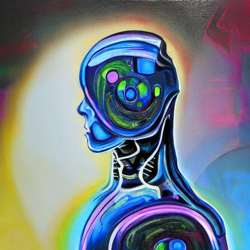
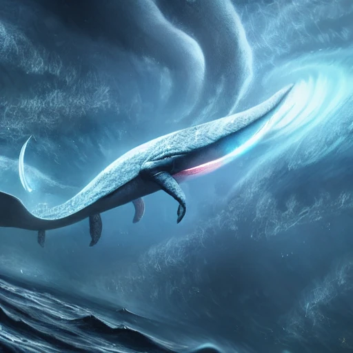

Title: Künstliche Kunst
Date: 2022-10-05 18:05
Author: surt91
Category: Code
Tags: Python, Bild, Neural Networks, GitHub, Twitter-Bot
LargeFeaturedImage: img/SpaceWhale2.webp
Status: published
Lang: de

Seit der Vorstellung von [DALL-E](https://de.wikipedia.org/wiki/DALL-E) Anfang 2021 sind Text-zu-Bild-Programme
im Bewusstsein der Öffentlichkeit angekommen. DALL-E 2.0 und [Midjourney](https://en.wikipedia.org/wiki/Midjourney)
haben immer wieder mit interessanten, verrückten und überraschend gut aussehenden Bildern auf sich aufmerksam
gemacht, die aber immer nur in sehr begrenztem Umfang von ausgewählten Usern auf Servern der Betreibern
generiert werden konnten. Aber seit August 2022 gibt es mit [Stable Diffusion](https://en.wikipedia.org/wiki/Stable_Diffusion)
das erste hochwertige Text-zu-Bild-Modell, dessen Neuronales Netzwerk offen ist und von
jedem (der eine Grafikkarte mit genügend Speicher hat) auf dem eigenen Computer genutzt werden kann!

Die grundlegende Funktionsweise ist, dass man dem Modell eine Bildbeschreibung, sogenannte *Prompts*, gibt und das Modell
versucht ein Bild zu rendern, das möglichst gut zu der Beschreibung passt. Die Kunst liegt nun darin,
die Bildbeschreibung so zu formulieren, dass das resultierende Bild möglichst gut wird.
Wenn wir wissen wollen, wie so eine künstliche Intelligenz überhaupt aussieht, können wir Stable Diffusion
darum bitten uns ein Bild von einer zu malen mit dem Prompt "a painting of an artificial intelligence":

In der Community findet man häufig Prompts, die mit vielen Adjektiven (wie "intricate" oder "highly detailed")
oder Künstlernamen (vor allem "Greg Rutkowski") gespickt sind. Für mich persönlich klingt es nach zu viel Arbeit
eine solche Liste von Schlüsselworten an eine knappe Bildbeschreibung zu hängen -- ich benutze schließlich
eine künstliche Intelligenz, die Bilder zeichnet, damit ich wenig Arbeit habe!

Die offensichtliche Lösung für dieses Problem ist es natürlich ein Sprachmodell zu benutzen, um Prompts zu
generieren. Glücklicherweise gibt es mit [lexica.art](https://lexica.art) eine Datenbank von Prompts, die
man nutzen kann, um ein [GPT-2](https://en.wikipedia.org/wiki/GPT-2) Modell zu finetunen. So kann man GPT-2
Modell mit "four dimensional space whale" füttern, GPT-2 macht daraus den Prompt
"four dimensional space whale, with recursive spiral eyes, concept art, high detail, intimidating, cinematic, Artstation trending, octane render",
der von Stable Diffusion zu diesem Bild gerendert wird:

Und damit ich auch keine Arbeit damit habe, die Bilder selbst zu generieren, habe ich einen Twitter-Bot
damit beauftragt täglich ein lovecraft'sches Bild zu tweeten: [@ACthulhuADay](https://twitter.com/ACthulhuADay).

Der Glue-Code, der diesen text2prompt2image-Ablauf implementiert (also
hauptsächlich Modelle von Huggingface herunterlädt) und diesen Bot antreibt, findet
sich auf [Github](https://github.com/surt91/ACthulhuADay).
