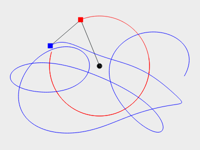
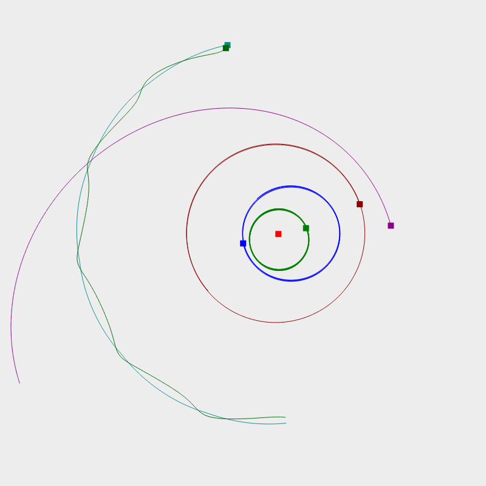

Title: DGLshow
Date: 2014-03-19 11:28
Author: surt91
Category: Code
Tags: C++, Physik, Video, Bild, GitHub, Formel, Chaos
Slug: dglshow
Status: published

<video controls="controls" height="576" width="592">
<source src="vid/doppelpendel.mp4" type="video/mp4"></source>

</video>

Das ist ein Doppelpendel. Ein Doppelpendel ist neben dem Dreikörperproblem und
dem Lorenz-Attraktor das Paradebeispiel für analytisch unlösbare Bewegungsgleichungen 
und chaotisches Verhalten. Aus diesem Grund sollte ein Doppelpendel auf keinem 
Schreibtisch fehlen und bietet sich als grandiose Geschenkidee für Physiker an.

Dass es analytisch unlösbar ist, lässt sich mit einem nicht rigorosen Argument
anschaulich machen: Ein Blick auf die Bewegungsgleichungen

\begin{align}
    (m_1 + m_2) l_1 \ddot{\theta_1} + m_2 l_2 \ddot{\theta_2} \cos(\theta_1 - \theta_2) + m_2 l_2 \dot{\theta_2}^2 \sin(\theta_1 - \theta_2) + g(m_1 + m_2) \sin(\theta_1) &= 0\\
    m_2 l_2 \ddot{\theta_2} + m_2 l_1 \ddot{\theta_1} \cos(\theta_1 - \theta_2) - m_2 l_1 \dot{\theta_1}^2 sin(\theta_1 - \theta_2) + m_2 g \sin(\theta_2) &= 0
\end{align}

Das sind die Differentialgleichung für die beiden Winkel $\theta_1$ und $\theta_2$
des Doppelpendels. $m_i$ sind die beiden Massen und $l_i$ die Fadenlängen.

Um die Zeit zu überbrücken, bis mir jemand eins schenkt, habe ich ein kleines C++
Programm mit einem adaptiven Runge-Kutta-4 Löser geschrieben, das mit den Qt
Zeichenprimitiven Lösungen visualisiert.

Anfangs empfiehlt es sich also etwas einfacheres und vertrauteres zu lösen.
Ich habe mich für den [Lorenz Attraktor]({filename}/schmetterlingseffekt.md)
\begin{align}
    \dot{X} &= a(Y - X) \\
    \dot{Y} &= X(b - Z) - Y \\
    \dot{Z} &= XY - cZ \\
\end{align}
und ein [Dreikörper Problem]({filename}/dreikorperproblem.md)
\begin{align}
    \ddot{\vec{x}_1} &= -\frac{Gm_2}{\left(x_1 - x_2\right)^3} (\vec{x}_1 - \vec{x}_2) - \frac{Gm_3}{\left(x_1 - x_3\right)^3} (\vec{x}_1 - \vec{x}_3)\\
    \ddot{\vec{x}_2} &= -\frac{Gm_1}{\left(x_2 - x_1\right)^3} (\vec{x}_2 - \vec{x}_1) - \frac{Gm_3}{\left(x_2 - x_3\right)^3} (\vec{x}_2 - \vec{x}_3)\\
    \ddot{\vec{x}_3} &= -\frac{Gm_1}{\left(x_3 - x_1\right)^3} (\vec{x}_3 - \vec{x}_1) - \frac{Gm_2}{\left(x_3 - x_2\right)^3} (\vec{x}_3 - \vec{x}_2)\\
\end{align}
entschieden.

Da man das 3-Körperproblem trivial auf ein $N$-Körperproblem erweitern kann,
habe ich hier ein "Sonnensystem" bzw. Bohrsches "Atom"-modell simuliert.

Auch wenn der Code nicht sehr aufgeräumt ist und Startwerte im Quellcode
angepasst werden müssen, sind die Quellen auf GitHub:
[github.com/surt91/DGLshow](https://github.com/surt91/DGLshow).

