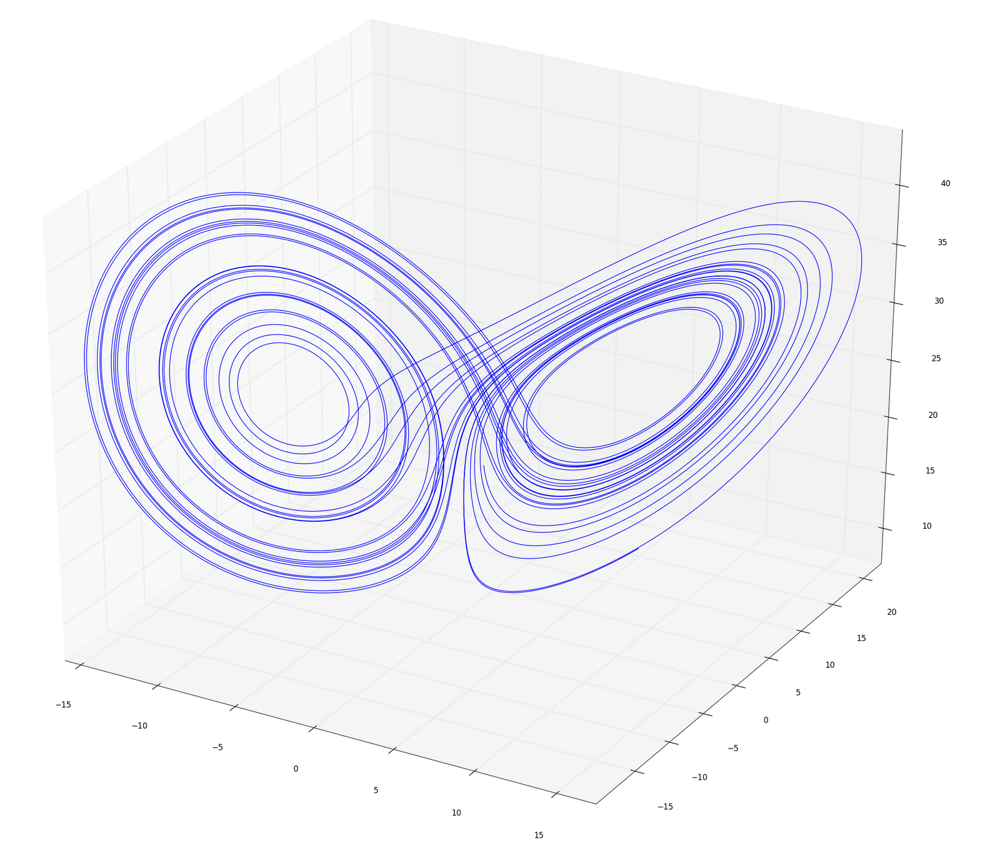

Title: Schmetterlingseffekt
Date: 2012-05-15 23:04
Author: surt91
Category: Code
Tags: Physik, C
Slug: schmetterlingseffekt
Status: published

Differentialgleichungen numerisch zu lösen macht mehr Spaß, als man
erwarten würde, wenn man es hört. Und sobald man den ersten
[Runge-Kutta](http://de.wikipedia.org/wiki/Klassisches_Runge-Kutta-Verfahren)-Algorithmus
in einer kommerziellen Interpretersprache geschrieben hat, bemerkt man,
dass dieses Skript doch recht lange braucht.

Für dieses Problem gibt es zwei Lösungen: Entweder wird man zum Guru und
wendet irgendeine okkulte Code-Magie an, um das Programm schneller
laufen zu lassen, oder man schreibt das Programm in einer schönen
Sprache neu. In C zum Beispiel. ([Quellen
hier](http://dl.dropbox.com/u/963344/blog/runge-kutta.tar.gz))

Ich habe mich für den einfachen Weg
entschieden und wenig überraschend eine Tempoverbesserung von Faktor
\~140 festgestellt. Jedenfalls für diesen
[Lorenz-Attraktor](http://de.wikipedia.org/wiki/Lorenzattraktor).
Geplottet habe ich die Werte dann mit [Python und
matplotlib](http://matplotlib.sourceforge.net/examples/mplot3d/lines3d_demo.html). 

Warum ich den Titel
"[Schmetterlingseffekt](http://de.wikipedia.org/wiki/Schmetterlingseffekt#Wissenschaftlicher_Hintergrund)"
gewählt habe? Naja, das Bild hier sieht ein wenig nach einem
Schmetterling aus :)

Davon abgesehen, wurde der Schmetterlingseffekt nach diesen
Differentialgleichungen benannt.

