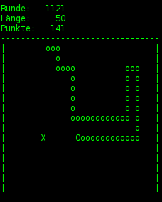

Title: Snake
Date: 2011-10-03 14:16
Author: surt91
Category: Code
Tags: C
Slug: snake
Status: published

Und wenn ich Snake sage, meine ich das Beste, was Nokia Handys zu bieten
haben. Jedenfalls vor 10 Jahren -- vermutlich immer noch. Aber weil ich
kein Nokia Handy habe, habe ich mir
[Snake](http://dl.dropbox.com/u/963344/blog/snake.tar.xz) schnell selbst
geschrieben -- in C.

Die Darstellung ist etwas suboptimal, aber dafür, dass es einfach nur
auf stdout schreibt, fühlt es sich doch sehr gut an.  
Was man noch erwähnen sollte: man steuert mit WASD.  
*Update:*  
Jetzt gibt es eine neue Version, die auf
[ncurses](http://de.wikipedia.org/wiki/Ncurses) aufsetzt. Neben der
verbesserten "Grafik" kann man jetzt auch die Pfeiltasten zur Steuerung
benutzen. Außerdem wirkt es sehr viel eleganter.  
Im Paket befinden sich die Linux Binary und Quellen.
